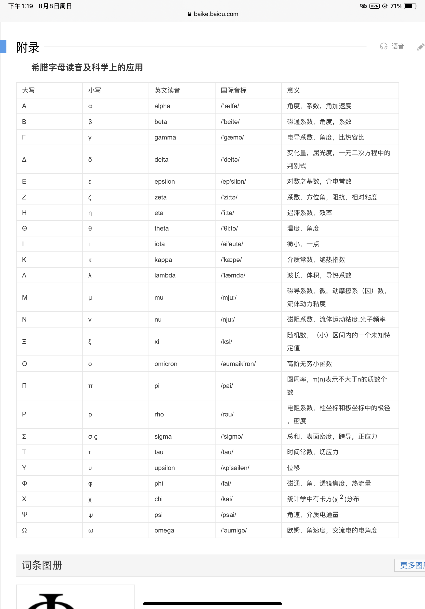

# Laplacian算子（拉普拉斯算子）

在[數學](https://zh.wikipedia.org/wiki/%E6%95%B8%E5%AD%B8)以及[物理](https://zh.wikipedia.org/wiki/%E7%89%A9%E7%90%86)中，**拉普拉斯算子**或是**拉普拉斯算符**（英語：**Laplace operator, Laplacian**
）是由[欧几里得空间](https://zh.wikipedia.org/wiki/%E6%AC%A7%E5%87%A0%E9%87%8C%E5%BE%97%E7%A9%BA%E9%97%B4)中的一個函数的[梯度](https://zh.wikipedia.org/wiki/%E6%A2%AF%E5%BA%A6)的[散度](https://zh.wikipedia.org/wiki/%E6%95%A3%E5%BA%A6)给出的[微分算子](https://zh.wikipedia.org/wiki/%E5%BE%AE%E5%88%86%E7%AE%97%E5%AD%90)，通常写成

$$
{\displaystyle \Delta }、{\displaystyle \nabla ^{2}}或{\displaystyle \nabla \cdot \nabla }
$$

拉普拉斯算子是最简单的[椭圆算子](https://zh.wikipedia.org/wiki/%E6%A4%AD%E5%9C%86%E7%AE%97%E5%AD%90)，并且拉普拉斯算子是[霍奇理論](https://zh.wikipedia.org/wiki/%E9%9C%8D%E5%A5%87%E7%90%86%E8%AB%96)的核心，並且是[德拉姆上同調](https://zh.wikipedia.org/wiki/%E5%BE%B7%E6%8B%89%E5%A7%86%E4%B8%8A%E5%90%8C%E8%B0%83)
的結果。在[图像处理](https://zh.wikipedia.org/wiki/%E5%9B%BE%E5%83%8F%E5%A4%84%E7%90%86)和[计算机视觉](https://zh.wikipedia.org/wiki/%E8%AE%A1%E7%AE%97%E6%9C%BA%E8%A7%86%E8%A7%89)中，拉普拉斯算子已经被用于诸如[斑点检测](https://zh.wikipedia.org/w/index.php?title=%E6%96%91%E7%82%B9%E6%A3%80%E6%B5%8B&action=edit&redlink=1)和[边缘检测](https://zh.wikipedia.org/wiki/%E8%BE%B9%E7%BC%98%E6%A3%80%E6%B5%8B)等的各种任务。

# 坐標表示式

---

## **二維空間**

$$
\Delta f = \frac{\partial^2f}{\partial x^2} + \frac{\partial^2 f}{\partial y^2}
$$

另外[極坐標](https://zh.wikipedia.org/wiki/%E6%9E%81%E5%9D%90%E6%A0%87%E7%B3%BB)的表示法為：

$$
\Delta f = {1 \over r} {\partial \over \partial r} \left( r {\partial f \over \partial r} \right) + {1 \over r^2} {\partial^2 f \over \partial \theta^2}
$$

在NS公式里面用jocobi迭代解算压力是这样的




```glsl Niagara
if (FluidCellCount > 0 && CellType == FLUID_CELL)
{
JacobiPressure = (P_right + P_left + P_up + P_down - density * dx * dx * Divergence / dt + BoundaryAdd) / FluidCellCount;
Pressure = (1.f - Weight) * P_center + Weight * JacobiPressure;
}
```

结算压力场


## ****三維空間****

**[笛卡兒坐標系](https://zh.wikipedia.org/wiki/%E7%AC%9B%E5%8D%A1%E5%85%92%E5%9D%90%E6%A8%99%E7%B3%BB)**下的表示法

$$
\Delta f = \frac{\partial^2 f}{\partial x^2} + \frac{\partial^2 f}{\partial y^2} + \frac{\partial^2 f}{\partial z^2}.
$$

**[圓柱坐標系](https://zh.wikipedia.org/wiki/%E5%9C%93%E6%9F%B1%E5%9D%90%E6%A8%99%E7%B3%BB)**下的表示法

$$
\Delta f = {1 \over \rho} {\partial \over \partial \rho} \left( \rho {\partial f \over \partial \rho} \right) + {1 \over \rho^2} {\partial^2 f \over \partial \theta^2} + {\partial^2 f \over \partial z^2 }.
$$

**[球坐標系](https://zh.wikipedia.org/wiki/%E7%90%83%E5%9D%90%E6%A8%99%E7%B3%BB)**下的表示法

$$
\Delta f = {1 \over r^2} {\partial \over \partial r} \left( r^2 {\partial f \over \partial r} \right) + {1 \over r^2 \sin \theta} {\partial \over \partial \theta} \left( \sin \theta {\partial f \over \partial \theta} \right) + {1 \over r^2 \sin^2 \theta} {\partial^2 f \over \partial \phi^2}.
$$